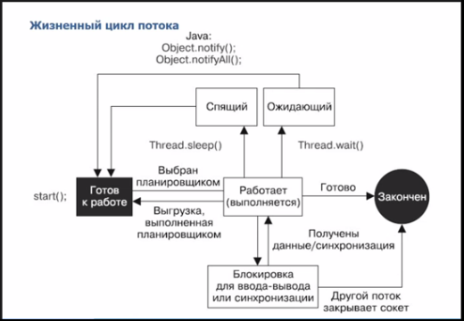

# Lesson 11: Java Threadds

## Вступление
При помощи команды ps в Linux и при помощи команды tasklist в windows можно вывести список всех процессов, запущенных в ОС на текущий момент.
Например, на Windows можем запросить все процессы Java:
```
tasklist /fi "imagename eq java.exe"
```
У каждого процесса своё так называемое "виртуальное адресное пространство", к которому у процесса есть прямой доступ. Это пространство доступно только процессу, содержит только его данные. Операционная система отвечает за то, каким образом виртуальное адресное пространство процесса проецируется на физическую память.

Один поток (thread) – это одна единица исполнения кода.
Поток — это процесс выполнения инструкций, который работает на выделенном процессоре, выполнение которого контролирует планировщик (scheduler) ОС, и который может быть заблокирован. Потоки создаются внутри процесса и пользуются общими ресурсами. Это означает, что, например, память и декскрипторы файлов, являются общими для всех потоков процесса. Подобный подход принято называть native threads.

Начиная с версии 1.2 Java поддерживает native threads, и с тех пор они используются по умолчанию. До этого использовался другой тип многопоточности, который называется green threads. Green threads — это, по сути, имитация потоков. Виртуальная машина Java берёт на себя заботу о переключении между разными green threads, а сама машина работает как один поток ОС. Но т.к. при green threads вы не можете исполнять два потока одновременно - от такого подхода отказались.
Подробнее: [Обзор моделей работы с потоками](https://habrahabr.ru/post/39543/).

Тот поток, с которого начинается выполнение программы, называется главным. После создания процесса, как правило, JVM начинает выполнение главного потока с метода main(). Затем, по мере необходимости, могут быть запущены дополнительные потоки.

Более детальное описание читать здесь: "[Многопоточность в Java](https://habrahabr.ru/post/164487/)".

В Java есть Планировщик Потоков(Thread Scheduler), который контролирует все запущенные потоки во всех программах и решает, какие потоки должны быть запущены, и какая строка кода выполняться.

Более подробно: [Потоки в Java (java threads)](http://www.quizful.net/post/java-threads).

## Главный поток
У любой Java программы есть главный поток - это поток, в котором началось выполнение программы.
При завершении данного потока завершаться все остальные потоки.
Подробнее: "[Введение в потоки Java](http://alfalavista.ru/idxfldr/2013-06-18-22-25-47/363-potoki-java.html)".
"[Main thread in Java](http://www.geeksforgeeks.org/main-thread-java/)"

Согласно документации, у каждого потока есть свой "[Thread ID](https://docs.oracle.com/javase/7/docs/api/java/lang/Thread.html#getId()".
У Main потока ID будет равен единице. Таким образом его можно идентифицировать.

Потоки объединяются в группы. main поток находится в main группе. Без особых указаний дочерние потоки будут созданы в ней же.
Пример поиска главного потока из дочернего:
```java
Thread[] threads = new Thread[Thread.currentThread().getThreadGroup().activeCount()];
Thread.currentThread().getThreadGroup().enumerate(threads);
for (Thread thread : threads) {
	if (thread.getId() == 1) {
		System.out.println("Main thread name is " + thread.getName());
		break;
	}
}
```

## Монитор
В Java есть понятие "Монитор".
Каждый объект в Java имеет монитор, ассоциированный с данным объектом/классом (в случае статики). Ссылка на этот монитор содержится в заголовке объекта.
На эту тему хороший обзор:
"[Monitors – The Basic Idea of Java Synchronization](http://www.programcreek.com/2011/12/monitors-java-synchronization-mechanism/)".
А так же полезно почитать ответы на вопросы:
"[Multithreading: часть 1](https://jsehelper.blogspot.ru/2016/01/multithreading-1.html)".
"[Собеседование по Java — многопоточность (вопросы и ответы)](http://javastudy.ru/interview/concurrent/)"

## Жизненный цикл потока
Про жизненный цикл можно ознакомиться здесь: [Lifecycle and States of a Thread in Java](http://www.geeksforgeeks.org/lifecycle-and-states-of-a-thread-in-java/).

Когда поток только создан (при помощи ```Thread thread = new Thread();```), то он имеет статус **NEW**. В таком положении он ещё не запущен и планировщик потоков ещё не знает ничего о новом потоке.

Когда для потока вызывается ```thread.start()```, поток переходит в состояние **Rubbable**. Теперь планировщик потоков знает про поток и управляет временем выполнения потока. Java не отличает статус "готов к работе" и "работает (выполняется)".

Когда поток жив, но не активен, он находится в одном из двух состояний:
- **Blocked** - ожидает захода в защищённую (protected) секцию, т.е. в synchonized блок.
- **Waiting** - ожидает другой поток по условие. Если условие выполняется - планировщик потоков запускает поток

Если поток ожидает по времени, то он находится в статусе **Timed Waiting**.
Если поток больше не выполняется (завершился успешно или с exception), то он переходит в статус **Terminated State**.

С учётом выше указанного можно ознакомиться с графическим представлением жизненного цикла:

Для того, чтобы узнать состояние поток (его state) используется метод **getState**.
Метод **isAlive** возвращает true, если поток не Terminated.

## IllegalMonitorStateException
При некорректной работе с монитором возникает IllegalMonitorStateException.
```java
try {
	wait(2000);
} catch (InterruptedException e) {
	e.printStackTrace();
}
```
Данный код бросит исключение IllegalMonitorStateException.
Чтобы понять, стоит отметить, что в данном случае ```wait``` равносиле ```this.wait(2000)```
Чтобы исправить ситуацию, нужно получить синхронизацию по монитору this:
```java
synchronized (this) {
	try {
		this.wait(1000);
	} catch (InterruptedException e) {
		e.printStackTrace();
	}
}
```
Чтобы понять, что происходит, можно представить, что монитор - это комната, в которую есть некоторая очередь. Как к врачу. Метод **wait** говорит, что поток становится в очередь в эту комнату, пока его не пригласят. Метод **notify** равносилен тому, как загорается лампочка, которая приглашает следующий поток в комнату:
```java
final Object room = new Object();
	new Thread(new Runnable() {
		@Override
		public void run() {
			try {
				sleep(2000);
			} catch (InterruptedException e) {
				e.printStackTrace();
			}
			synchronized (room){
				room.notify();
			}
		}
	}).start();

	synchronized (room) {
		try {
			room.wait();
		} catch (InterruptedException e) {
			e.printStackTrace();
		}
	}
```
Про пример с комнатой спасибо "[Monitors – The Basic Idea of Java Synchronization](https://www.programcreek.com/2011/12/monitors-java-synchronization-mechanism/)".

## Потоки демоны
Поток может быть потоком демоном и не демоном.
Чтобы узнать, является ли поток демоном необходимо у потока вызвать метод **isDaemon**.
Чтобы поток стал демоном, необходимо это указать явно:
```java
Thread daemon = new Thread();
daemon.setDaemon(true);
daemon.start();
```
Важно, что после старта поток нельзя поменять этот статус, будет выброшен IllegalStateException.
Так же важно, что потоки демоны не могут существовать без обычных потоков. Поэтому, потоки демоны могут быть прерваны в любой момент. Autocloseable ресурсам не будет вызван close. Поэтому, гарантировать правильное закрытие ресурсов нет возможности.
Хотя ресурсы при завершении главного потока и завершения процесса JVM должны быть освобождены, такой гарантии не даётся. Подробнее: [Are resources used by a Java application freed when it terminates?](https://stackoverflow.com/questions/10906226/are-resources-used-by-a-java-application-freed-when-it-terminates).

**Интересный факт:**
Термин был придуман программистами проекта MAC Массачусетского технологического института, он отсылает к персонажу мысленного эксперимента, демону Максвелла, занимающегося сортировкой молекул в фоновом режиме.

Демон также является персонажем греческой мифологии, выполняющим задачи, за которые не хотят браться боги. Как утверждается в «Справочнике системного администратора UNIX», в Древней Греции понятие «персональный даймон» было, отчасти, сопоставимо с современным понятием «ангел-хранитель».
Источник: [Википедия](https://ru.wikipedia.org/wiki/Демон_(программа).

Подробнее про потоки-демоны: [What is Daemon Thread in Java? ](http://crunchify.com/what-is-daemon-thread-in-java-example-attached/)

## Метод join
Для координации между потоками существует метод **join**
Он позволяет потоку, из которого вызывается метод указать поток, заверешение выполнения которого необходимо ожидать.
Подробнее: [Пример использования Java Thread Join()](https://javadevblog.com/primer-ispol-zovaniya-java-thread-join.html)

## wait, notify
Ранее при объяснении монитора было наглядно показано, что wait - ожидание монитора, notify - информирование о том, что в монитор можно заходить.
notify может быть в двух вариантах: notify и notifyAll
О различии: [Difference between notify and notifyAll in Java](http://www.java67.com/2013/03/difference-between-wait-vs-notify-vs-notifyAll-java-thread.html)
[What are wait(), notify() and notifyAll() methods?](http://howtodoinjava.com/core-java/multi-threading/how-to-work-with-wait-notify-and-notifyall-in-java/)

## Классы синхронизированных коллекций java.util.concurrent
Для облегчения работы в многопоточной среде с коллекцями добавлены Concurrent Collections.
Отличный обзор приведён тут: [Обзор java.util.concurrent.*](https://habrahabr.ru/company/luxoft/blog/157273/).
И [Understanding Collections and Thread Safety in Java](http://www.codejava.net/java-core/collections/understanding-collections-and-thread-safety-in-java).
Обзор по каждой коллекции: [Java Concurrent Collection Classes](http://javapapers.com/java/java-concurrent-collections/).

## Дополнительно:
[Java Callable. Краткое описание и пример использования](https://javadevblog.com/java-callable-kratkoe-opisanie-i-primer-ispol-zovaniya.html)

[Синхронизаторы](https://habrahabr.ru/post/277669/).