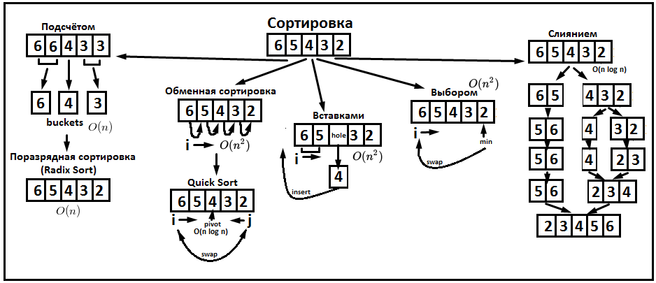

# Lesson 12: Algorithms: Simple sort
## Вступление
**Алгоритмы** - набор инструкций, описывающий действия, которые необходимо выполнить для достижения некоторого результата. Они описываются в такой обширной теме, как **"Алгоритмы и структуры данных"**. Именно под таким названием можно найти различные программы обучения, книги или дополнительные курсы.
Нас окружают данные. Везде. Всё вокруг нас - это нескончаемый поток данных. И одно из основных действий, которое мы вополняем с этими данными - сортировка.
Вот краткий обзор того, какие есть сортировки:


## Перемена мест (swap)
Дополнительно может возникнуть вопрос, а как же можно поменять значения местами?
Существует несколько способов.
**Первый и самый понятный**: использование промежуточной переменной.
**Второй вариант**: XOR SWAP (см. [How does the XOR (^) swap algorithm work?](https://stackoverflow.com/questions/21093606/how-does-the-xor-swap-algorithm-work))
```
a = a^b;
b = a^b;
a = a^b;
```
**Третий вариант**: "математические костыли"
```java
int x=2;
int y=4;
y=(x+y)-(x=y);
```
**Четвёртый вариант:** При работе с List можно использовать **Collections.swap**


## Сортировка пузырьком (bubble sort)
Одним из самых простейших алгоритмов сортировка является сортировка пузырьком (или методом простого обмена). Ещё её иногда называют глупой сортировкой.

Назвали ей так по аналогии с пузырьками в воде. Как известно, воздух легче воды, поэтому пузырьки воздуха всплывают. В пузырьково сортировке более легкие (с меньшим значением) элементы постепенно "всплывают" в начало массива, а более тяжелые друг за другом опускаются на дно (в конец массива).

**Видео:** "[CS50: Bubble Sort](https://www.youtube.com/watch?v=8Kp-8OGwphY)"
Ещё немного Гарварда: "[CS50: Buble Sort2](https://javarush.ru/quests/lectures/questharvardcs50.level03.lecture09)"
**Идея:** Имеем массив данных. Берём пару элементов и сравниваем их. Если элемент слева больше, чем элемент справа - меняем их местами. Переходим к следующему элементу. Завершитя всё тогда, когда за полный проход по массиву не будет сделано ни одной замены.
В худшем случае будет выполнено n-1 замен.
**Сложность алгоритма:** Квадратичная, (n^2), т.к. для каждого элемента мы проходимся по всем элементам.
**Реализация:**
```java
public static void bubbleSort(int[] source) {
		boolean isSorted;
		do {
			isSorted = true;
			for (int i = 0; i < source.length - 1; i++) {
				if (source[i] > source[i + 1]) {
					int tmp = source[i];
					source[i] = source[i + 1];
					source[i + 1] = tmp;
					isSorted = false;
					break;
				}
			}
		} while (!isSorted);
	}
```
**Материал:** Про пузырьковую сортировку и её вариации есть отличная статья: [Пузырьковая сортировка и все-все-все](https://habrahabr.ru/post/204600/).
Дополнительно можно прочитать статью: [Глупая сортировка и некоторые другие, поумнее](https://habrahabr.ru/post/204968/).

## Сортировка выбором (Selection Sort)
Ещё одна простая сортировка.
Суть: мы выбираем каждый проход минимальный элемент, сокращая каждую итерацию границы, в пределе которых выполняем поиск минимального элемента.

**Видео:** "[CS50: Selection Sort](https://www.youtube.com/watch?v=f8hXR_Hvybo)
Ещё немного Гарварда: [CS50: Selection Sort2](https://javarush.ru/quests/lectures/questharvardcs50.level03.lecture08)
Другая вариация: "[KC Ang: Selection Sort](https://www.youtube.com/watch?v=79AB11J5BqU)".
**Сложность алгоритма:** Квадратичная, (n^2).
**Идея: ** Двигаем курсор(i) начиная с первого элемента массива до последнего. За этим курсором остаётся отсортированная часть, к которой мы не возвращаемся. Для каждого положения курсора пробегаемся по всем оставшимся элементам и находим индекс элемента, значение которого является минимальным. Меняем его с элементом, находящимся в положении курсора. Продвигаем курсор на 1 положение вперёд. И так, пока не достигнем конца массива.
**Реализация:**
```java
public static void selectionSort(int[] source) {
	System.out.println(Arrays.toString(source));
	for (int i = 0; i < source.length; i++) {
		int minIndex = i;
		for (int min = i+1; min < source.length; min++) {
        	if (source[min] < source[minIndex]) {
				minIndex = min;
			}
		}
		if (i != minIndex) {
			swap(source, i, minIndex);
		}
	}
}
```

## Сортировка вставками (Insertion Sort)
Ещё одним простым способом сортировки является сортировка вставками.

**Видео:** "[CS50: Insertion Sort](https://www.youtube.com/watch?v=DFG-XuyPYUQ)
Ещё немного Гарварда: "[CS50: Insertion Sort](https://javarush.ru/quests/lectures/questharvardcs50.level03.lecture10)"
Рисование на доске: "[Java Insertion Sort Explained](https://www.youtube.com/watch?v=mXA1ICs3K4Y)"
**Материал: ** Отличное описание приведено в статье "[В мире алгоритмов: Сортировка Вставками](https://m.habrahabr.ru/post/181271/)".
Обзор: "[Сортировка массива](https://edunow.su/site/content/algorithms/sortirovka_massiva)"
**Суть:** Перемещаем курсор i слева направо. Каждый элемент сравнивае с элементами слева в поисках того места, в которое можно как-бы "вставить" обрабатываемый элемент.
Поэтому и называется способ: сортировка вставками.
В выше указанной статье приведён хороший бытовой пример: сортировка денег в кошельке.
**Временная сложность:** Квадратичная, т.е. O(n2).
**Реализация: **
```java
public static void insertionSimpleSort(int[] source) {
		// Take out value by value, make a "hole" on this place
		for (int holePosition = 0; holePosition < source.length; holePosition++) {
			int takenValue = source[holePosition];
			// Move cursor(or iterator) while we have an element before hole
            // and this element bigger than taken value
			int i;
			for (i = holePosition - 1; i >= 0 && takenValue < source[i]; i--) {
				source[i + 1] = source[i];
			}
			source[i + 1] = takenValue;
		}
	}
```
Как видно, мы перемещаемся элемент за элементом. Вынимаем значение элемента и вместо него образуется как бы "дыра". Далее мы начинаем от этой "дыры" двигаться в обратную сторону. Если элемент перед "дырой" меньше, чем вынутое значение, то "дыра" заполняется этим элементом.
Если элемент больше, то цикл прерывается. Т.к. значение вынуто, то нужно обратно вернуть его в "дыру". Курсор указывается на место, где стоит элемент, больший чем вынутое значение. Поэтому вернём курсор обратно, компенсировав ``holePosition - 1``

## Челночная сортировка (Shuttle Sort)
Есть ещё такая сортировка, как **Shuttle Sort**. На русском переводится как челночная сортировка. Хотя, мне больше нравится аналогия с космическими шатлами )
Это странная сортировка, потому что она похожа одновременно на сортировку пузырьком и на сортировку вставками.
Является улучшенной версией пузырьковой сортировки обменом, но сложность по прежнему квадратичная. Уменьшается лишь колиество обмена элементов.

**Видео:** "[AQA Decision 1 2.02a Introducing Shuttle Sort](https://www.youtube.com/watch?v=o6uFbepNNpY)"
**Сложность алгоритма:** Квадратичная, (n^2).
**Реализация: **
```java
public static void insertionSimpleSort(int[] source) {
	// Take out value by value, make a "hole" on this place
	for (int holePosition = 0; holePosition < source.length; holePosition++) {
		int takenValue = source[holePosition];
		// Move cursor while we have an element before hole
        // and this element bigger than taken value
		int c;
		for (c = holePosition - 1; c >= 0 && takenValue < source[c]; c--) {
			source[c + 1] = source[c];
		}
		source[c + 1] = takenValue;
	}
}
```

## Сортировка Шелла
Сортировка Шелла - улучшенная сортировка вставками.
Соответственно, сложность у неё квадратичная.
Основное отличие - сравнение начинается на выбранном удалении элементов друг от друга с постепенным уменьшением диапазона (есть разные подходы к определению дистации или так называемого gap).

**Видео:**
"[AQA Decision 1 2.03a Shell Sort - an example with 8 numbers](https://www.youtube.com/watch?v=dZyvhPIqpH0)"
"[Shell Sort | GeeksforGeeks](https://www.youtube.com/watch?v=SHcPqUe2GZM)"
**Материал:**
Статья: "[Алгоритмы сортировки. Shell Sort](https://medium.com/@dimko1/алгоритмы-сортировки-shell-sort-f7a5f75427c1)"
**Реализация:**
```java
public static void shellSort(int[] source) {
	// Calculate the gap
	int gap = source.length / 2;

	while (gap >= 1) {
		// Iterate from left to right
        for (int i = 0; i < source.length; i++) {
			// Move cursor not from gap value and iterate backward
			for (int c = i - gap; c >= 0 && source[c] > source[c + gap]; c -= gap){
				xorSwap(source, cursor, cursor + gap);
			}
		}
		// Decrease the gap value
		gap = gap / 2;
	}
}
```
**Суть:**
Вычисляем шаг или разрыв, т.е. gap. Можно начать с того, что он будет равен половине массива. Далее проходимся по всем элементам массива. Найдя такой элемент массива, который можно сравнить с элементом массива, меньшим по индексу на величину разрыва - сравниваем и меняем. Если с тем элементом можем повторить так же - повторяем.
После прохода по всем элементам уменьшаем разрыв, уменьшая его величину вдвое.

## Дополнительные материалы
[Бесплатный курс на Coursera](https://www.coursera.org/learn/algorithms-part1)
[Ещё один курс на Coursera](https://www.coursera.org/specializations/algorithms)

Все указанные сортировки описаны здесь: "[Сортировка массива](https://edunow.su/site/content/algorithms/sortirovka_massiva)"
Визуализация алгоритмов:
[sorting.at](http://sorting.at/)
[visualgo.net](https://visualgo.net/en/sorting)

Продолжение см в [Lesson13](./lesson13.md)