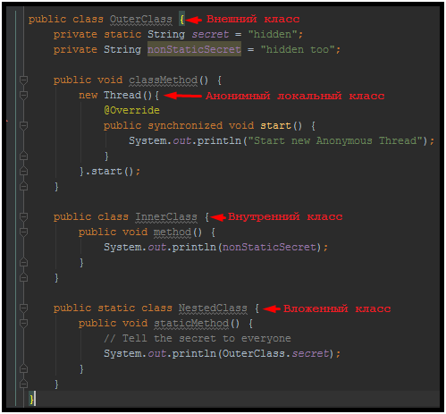
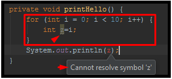

# Lesson 15: Scopes, Inner classes, override

## Введение
На 1 файл с расширением **.java** приходится 1 Java класс.
И в целом, это правильная позиция с точки зрения инкапсуляции.
Но самое интересное то, что класс может содержать внутри другие классы, которые будут являться членами внешнего класса.
Обзор: "[Внутренние классы в Java (inner classes java)](http://www.quizful.net/post/inner-classes-java)".

Главное что нужно понять и тогда поведение будет крайне предсказуемо.
Внутренний класс являестя членом внешнего класса так же, как и поля.
Следовательно, внутренние классы ведут себя по правилам внутренних членов класса.
Внутренние классы делятся на:
- Вложенные классы
- Внутренние классы

Внутренние классы делятся на:
- Локальные классы
- Локальные анонимные классы

Пример:


И на самом деле всё логично. Так как внутренние классы находятся внутри класса снаружи, они находятся внутри фигурных скобок, обозначающих scope. Поэтому, они имеют доступ ко всему, даже private.
Далее, статические классы называются вложенными, потому что они как бы одновременно и сами по себе и часть другого класса (статическая часть). Логично, что такие классы не могут иметь доступ к нестатическим полям внешнего (Outer) класса.

## Интересности
Внутренние классы можно инстанциировать через необычную на первый взгляд конструкцию:
```java
public class OuterClass {

	public class InnerClass {
		public void print() {
			System.out.println("Hello!");
		}
	}

	public void innerClassConstructor() {
		OuterClass clazz = new OuterClass();
		clazz.new InnerClass().print();
	}
}
```

Так же можно обращаться из внутреннего класса во внешний:
```java
public class OuterClass {

	public class InnerClass {
		public void callOuterClass() {
			OuterClass.this.printHello();
		}
	}

	private void printHello() {
		System.out.println("Hello");
	}

	public void innerClassConstructor() {
		OuterClass clazz = new OuterClass();
		clazz.new InnerClass().callOuterClass();
	}
}
```

## Область видимости (scopes)
Область видимости - это та зона, внутри которой доступны объекты, классы, переменные и т.д. Если говорить очень просто, то область видимости указывается модификатором доступа + ограничивается фигурными скобками.
Список модификаторов доступа Java:
- private: члены класса доступны только внутри класса
- default (package-private) (модификатор, по-умолчанию): члены класса видны внутри пакета (если класс будет так объявлен он будет доступен только внутри пакета)
- protected: члены класса доступны внутри пакета и в наследниках
- public: члены класс доступны всем

На самом деле ключевое слово **default** не используется для обозначения default доступа. Оно зарезервировано для обозначения методов по умолчанию в интерфейсах, начиная с Java 8. Поэтому, указание этого слова как модификатора доступа является ошибкой и такой код скомпилирован не будет.

Область видимости так же может быть ограничена фигурными скобками внутри методов, например, в циклах:


## Перегрузка и переопределение
При наследовании мы можем переопределять или перегружать методы.
**Переопределение метода** - это изменение поведение родителя путём повторного объявления метода родителя с той же сигнатурой.
**Перегрузка метода** - это дополнение поведения родителя путём объявления метода родителя с расшиерением сигнатуры родителя.
Например, если метод родителя не принимал аргументы, в дочернем классе можно добавить аргумент.

Важно помнить, что "область видимости" методов будет определяться типом объекта, который был указан. Например:
```java
public class OuterClass {

	public void print() {
		System.out.println("1");
	}

	class InnerClass extends OuterClass {
		public void print(String test) {
			System.out.println(test);
		}
	}

	public static void main(String[] args) {
		OuterClass obj = new OuterClass().new InnerClass();
		obj.print("test"); //Ошибка
	}

}
```
Что логично, т.к. мы говорим "Я буду рабоать с obj как с OuterClass". У OuterClass есть строго определённые методы. Вот с ними и будем работать.

Важно, что при переопределении метода, который бросает исключения, мы не можем расширять тип бросаемого исключения. Можем только уточнять:
```java
public class OuterClass {

	public void print() throws Exception {
		System.out.println("1");
	}

	class InnerClass extends OuterClass {
		public void print() throws IOException {
			System.out.println(test);
		}
	}
```

## Хитрости
Если есть поле, сокрытое в наследнике, то:
- Получая публичное поле через объект - влияет тип поля, а не тип объект
- Получая публичное поле через метод - влияет тип объекта, а не тип поля