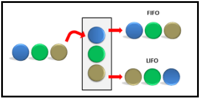
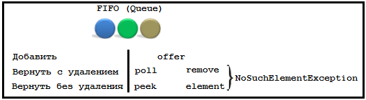

# Lesson 16: Queue, Dequeue

## Введение
В языке Java релаизованы такие структуры данных, как очереди.
Очереди по типу работы с ней можно разделить на 2 типа:
- LIFO - Last In, First Out
Очередь по принципу стэка. То что было добавлено позднее будет обработано раньше, чем то, что было добавлено раньше.
- FIFO - First In, First Out
Это обычная очередь, как в магазине. Каждый элемент становится за предыдущим и обрабатываются в порядке добавления. Чем раньше был добавлен, тем раньше будет обработан.

Пример различий подходов:


Очереди же в свою очередь можно поделить на следующие виды:
- Однонаправленная
- Двунаправленная

Отличие двунапарвленной очереди состоит в том, что мы, как следует из названия, можем работать с любой из сторон очереди (т.е. как с её начала, так и с её конца).

## Однонаправленные очереди
Реализации однонаправленных очередей имплементируют интерфейс Queue.
Как указано в JavaDoc к интерфейсу, ```Queues typically, but do not necessarily, order elements in a FIFO (first-in-first-out) manner.```

Какой метод что делает и чем отличается можно запомнить по переводу слов:
**poll** переводится как "подрезать верхушку"
**peek** переводится как "заглянуть"

Известные реализации можно посмотреть в [Java API](https://docs.oracle.com/javase/8/docs/api/java/util/Queue.html).
Как мы видим, одной из реализаций является **PriorityQueue**.
Реализация основана на основе структуры данных: куча
```
based on a priority heap. The elements of the priority queue are ordered according to their natural ordering, or by a Comparator provided at queue construction time, depending on which constructor is used.
```
Подробнее про структуру данных:
в "[Структуры данных. Неформальный гайд](https://habrahabr.ru/post/263765/)".
видео: [Introduction to Binary Heaps](https://www.youtube.com/watch?v=WCm3TqScBM8)

Так же стоит отметить, что:
```
A priority queue relying on natural ordering also does not permit insertion of non-comparable objects (doing so may result in ClassCastException).
```
Основана на массиве, чем размер по умолчанию равен 11.
Увеличение размера происходит интересным образом:
```java
// Double size if small; else grow by 50%
        int newCapacity = oldCapacity + ((oldCapacity < 64) ?
                                         (oldCapacity + 2) :
                                         (oldCapacity >> 1));
```
На вершине — минимальный элемент (согласно его компаратору).
Добавление/удаление — это O(log N), получение элемента — O(1).

Вычисление индекса родительского узла выполняется следующим образом:
```
0 - индекс root (1 элемент)
1 - индекс элемента, дочернего от root (root+1)
2 - индекс элемента, дочернего от root (root+2)
3 - индекс элемента, дочернего от элемента 1
4 - индекс элемента, дочернего от элемента 1
Родитель текущего узла: (индекс элемента - 1) >>> 1
Например: (4-1) >>> 1 = 1
```
Пример применения:
```java
@Test
public void shouldSortItemsInPriorityQueue(){
	PriorityQueue queue = new PriorityQueue();
	queue.offer(10);
	queue.offer(1);
	queue.offer(5);
	assertEquals(1,queue.poll());

	queue = new PriorityQueue(Collections.reverseOrder());
	queue.offer(10);
	queue.offer(1);
	queue.offer(5);
	assertEquals(10,queue.poll());
}
```

## Двунаправленные очереди
Двунаправленные очереди реализуют интерфейс **Deque**, который является наследником Queue.
Позволяют работать с очередью с обеих сторон.
Так же призван заменить собой старую реализацию синхронизированного **Stack**.

Примером реализаций является: ArrayDeque, LinkedList.
ArrayDeque основан на массиве, а LinkedList основан на связанном списке.
ArrayDeque быстрее LinkedList, о чём говорит даже Java API для класса ArrayDeque:
```
This class is likely to be faster than Stack when used as a stack, and faster than LinkedList when used as a queue.
```