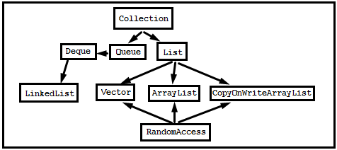

# Lesson 17: Lists

## Введение
**java.util.List** является часть **Java Collection Framework**.
Является интерфейсом, который расширяет интерфейс **Collection**.

List — это упорядоченный список. Объекты хранятся в порядке их добавления в список. Доступ к элементам списка осуществляется по индексу.

В соответствии с Oracle Tutorial: "[The List Interface](https://docs.oracle.com/javase/tutorial/collections/interfaces/list.html)" можно выделить следующие особенности:
- Работа с элементами основываясь на их числовой позиции в списке (на их индексе)
К этому относятся такие методы, как get, set, add, addAll, and remove.
- Обеспечение возможности поиска элемента и возвращение индекса его позиции в списке.
К этому относятся такие методы, как indexOf and lastIndexOf
- Обеспечение получения подсписков (Range-view), которые являются представлением изначального списка.
- Реализация ListIterator'а для двустороннего обхода и выполнения операций вставки и замещения элементов.

## LinkedList
Является двусвязным списком, в котором каждый элемент Node знает про следующий элемент и предыдущий.
Добавление выглядит как создание нового Node и переформирование ссылок в Node.

Хороший обзор представлен тут: "[Структуры данных в картинках. LinkedList](https://habrahabr.ru/post/127864/)"
А так же пункты про LinkedList из обзора "[Собеседование по Java — коллекци](http://javastudy.ru/interview/collections/)".
[LinkedList](http://developer.alexanderklimov.ru/android/java/linkedlist.php)
Количество объектов не ограничивается ничем, только объёмом Heap.

## ArrayList
Список, основанный на массиве. Имеет размер по умолчанию равный 10. При достижении границы размер увеличивается в 1.5 раза (при 10 станет 15, при 20 станет 30). Высчитывается по формуле: ```oldCapacity + (oldCapacity >> 1)```, т.е. старое значение + половина старого значения.
Обзор данной структуры данных можно прочитать на хабре:
"[Структуры данных в картинках. ArrayList](https://habrahabr.ru/post/128269/)"

Важно помнить, что изменение размера является ничем иным, как Arrays.copyOf.
Удаление элементов просто оставляет null на месте элемента, поэтому чтобы массив имел нужный размер необходимо выполнить метод **trimToSize**.
Так же можно увно увеличить внутренний массив до нужного массива, выполним метод **ensureCapacity**.

## CopyOnWriteArrayList
Пакет **java.util.concurrent** содержит версию ArrayList для использования в многопоточной среде.
Отличается тем, что при каждом изменении происходит копирование внутреннего массива. Это позволяет добиться того, что при получении итераторов мы получаем ссылку на массив, который не будет изменён, т.к. мы будем работать с ссылкой на прошлый массив.
Так же итератор по данной коллекции не поддерживает метод remove (кидает UnsupportedOperationException). Отсюда же вытекает тот факт, что даже ListIterator не позволяет модифицировать коллекцию.

Подробнее: "[Теория и практика Java : Параллельные классы коллекций](https://www.ibm.com/developerworks/ru/library/j-jtp07233/index.html)"
И обзор "[Guide to CopyOnWriteArrayList](http://www.baeldung.com/java-copy-on-write-arraylist)"