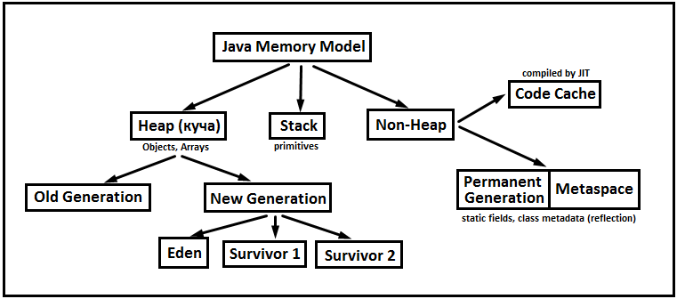

# Lesson 02: Java memory Model
## Разделение памяти
Память в Java можно условно разделить на следующие разделы:
- Heap (куча)
- Non-Heap (не куча)
- Stack (стэк)
Примерная схема выглядит так:


**Heap** - это основной сегмент памяти, где хранятся объекты. Он делится на два подсегмента: **Old Generation** и **New Generation**.
**New Generation** делится на подсегменты: **Eden** и два сегмента **Survivor**.
При запуске Java приложения **JVM** загружает необходимые классы (например, базовые классы из rt.jar, которые входят в JRE) в хип. Про загрузку классов можно прочитать в статье на хабре: [Загрузка классов в Java. Теория](https://habrahabr.ru/post/103830/).

**Non-heap** подразделяется на: **Permanent Generation** и **Code Cache**.
**Permanent Generation** содержит набор метаинформации о классах, которая может исопльзоваться, например, в Reflection. Подробнее можно прочитать в [Permanent область памяти](http://www.javaspecialist.ru/2011/04/permanent.html). Статья 2011 года, но основной смысл PermGen'а она передаёт. В Java8 PermGen заменён на **Metaspace** - его динамически изменяемый по размеру аналог.
Важно упоминуть, что именно здесь живут статические поля.
Подробнее тут: "[Как в java хранятся статические поля?](https://ru.stackoverflow.com/questions/466504)"
Так же PermGen\Metaspace относится к **"Method Area"**, в то время как "Code Cache" относится к **"Native Area"**.

**Stack** - это память, своего рода "оперативная память метода", работающая по схеме LIFO (Последний-зашел-Первый-вышел). Когда вызывается метод, то для него в памяти стека создаётся новый блок, называемый фрэймом. Он содержит:
- Примитивные типы
- Ссылки на другие объекты
Когда метод завершает работу, блок перестаёт использоваться и освобождается.
Размер стековой память намного меньше объёма памяти в куче.

## Пример
Для наглядности, можно написать простой Java класс:
```java
public class HelloWorld {
    public static void main(String[] args) {
		System.out.println("Hello, world");
    }
}
```
Компилируем в **javac** и выполняем дизассемблирование при помощи **javap**:
```
javac HelloWorld.java && javap -s -verbose -c HelloWorld.class >hw.txt
```
Открываем наш файл и смотрим, что мы сможем увидеть. Прежде всего, самая главная для нас информация это: "**Constant pool**". Располагается он в **PermGen**, подробнее можно прочитать в [RUNTIME DATA AREAS – JAVA’S MEMORY MODEL](http://www.pointsoftware.ch/en/under-the-hood-runtime-data-areas-javas-memory-model). Описание того, как хранится "System.out.println" в пуле констант можно прочитать тут: [Пул констант](https://habrahabr.ru/post/222519/).

Далее, ниже, мы видим фрагмент представления байт-кода:
```
public HelloWorld();
    descriptor: ()V
    flags: ACC_PUBLIC
    Code:
      stack=1, locals=1, args_size=1
         0: aload_0
         1: invokespecial #1  // Method java/lang/Object."<init>":()V
         4: return
      LineNumberTable:
        line 1: 0
```
Сначала может возникнуть вопрос, откуда взялся тут конструктор, ведь мы ничего не писали. Но потом мы вспоминаем, что все классы - наследники Object. Поэтому, конструктор по умолчанию есть всегда, если не определено иное (т.е. не указан конструктор с параметрами). Итак, мы имеем конструктор. Что будет делать конструктор, в случае вызова?
``aload_0`` - загружает (load) на вершину стэка this (можно ознакомиться в статье "[Структура байт-кода виртуальной машины Java](https://habrahabr.ru/post/69797/)" и "[JVM Internals](http://blog.jamesdbloom.com/JVMInternals.html)"). Как мы помним, стэк содержит ссылки на объекты, так что всё сходится.
``invokespecial #1`` - запуск метода из констант пула. Метод, указанный в константе 1. Используется для конструкторов, вызов через super и для private методов.
``return`` - возвращение из методы. Т.к. перед return не стоит символа, обозначающего возвращаемый результат, значит метод наш возвращает void, т.е. ничего не возвращает.
Стоит отметить, что рядом с командами стоят цифры. Эти цифры - это указание на позицию инструкции внутри фрейма. То, что 2 и 3 нет - это не странность. Это из-за того, что в команде 1 используется 2 параметра.
В пуле констант указано, что: ``#1 = Methodref          #6.#15``. Те самые 2 параметра.
Подробнее в статье [Java Bytecode Fundamentals](https://habrahabr.ru/post/111456/)

```
public static void main(java.lang.String[]);
 descriptor: ([Ljava/lang/String;)V
 flags: ACC_PUBLIC, ACC_STATIC
 Code:
  stack=2, locals=1, args_size=1
     0: getstatic     #2   //Field java/lang/System.out:Ljava/io/PrintStream;
     3: ldc           #3   //String Hello, world
     5: invokevirtual #4  //Method java/io/PrintStream.println:(Ljava/lang/String;)V
     8: return
  LineNumberTable:
     line 4: 0
     line 5: 8
```
Как мы видим, это описание второго стэка, так как это другой метод.
``getstatic #2`` - кладёт в стэк статическое значение из пула констант. Константа 2
``ldc #3`` - кладём в стэк не статическое значение из пула констант. Константа 3
``invokevirtual #4`` - выполняем метод из константы 4 (см. особенности invokespecial)
Возвращаем **void**, т.к. **return**

Итого, как мы видим, в стэке указываются методы и локальные переменные.
#### Дополнительные материалы
[Что такое Heap и Stack память в Java?](https://javadevblog.com/chto-takoe-heap-i-stack-pamyat-v-java.html)
[JavaCode To ByteCode](http://blog.jamesdbloom.com/JavaCodeToByteCode_PartOne.html)
[Java Bytecode Fundamentals](https://habrahabr.ru/post/111456/)


## Сборка мусора
Одной из частей JVM является сборщик мусора или **Garbage Collector**.
По теме сборщика мусора есть хорошие материалы:

Цикл статей [Дюк, вынеси мусор!](https://habrahabr.ru/post/269621)
Обзор [Garbage Collection наглядно](https://habrahabr.ru/post/112676)
Видео-лекция [Сборка мусора в Java](https://www.youtube.com/watch?v=FEraejGeul8)
Видео-лекция [Garbage First](https://www.youtube.com/watch?v=D9LDIp9FuYI)