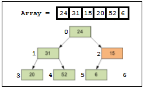

# Lesson 22: Coding practice

## <a name="toc"></a> Оглавление:
- [Подготовка](#prepare)
- [Сортировка](#sort)
-- [Bubble Sort](#bubble)
-- [Shuttle Sort](#shuttle)
-- [Selection Sort](#selection)
-- [Insertion Sort](#insertion)
-- [Heap Sort](#heap)
-- [Merge Sort](#merge)
- [Немного математрики](#math)
- [Рекурсия](#recursion)
- [Действия со строками](#strings)

## <a name="prepare"></a> Подготовка
Иногда, полезно выйти из зоны комфорта и потренироваться вне IDE, которая подскажет, подставит что нужно и куда нужно, укажет ошибки. Для тренировки идеально подходит редактор [Sublime Text 3](https://www.sublimetext.com/3). Одновременно полезен и эстетичен.
После запуска необходимо:
- Добавить **Build System**.
Для этого переходим в **"Tools" -> "Build System" -> "New Build system"**,
Меняем содержимое на следующее:
```
{
	"cmd": ["java", "$file_base_name"]
}
```
Сохраняем, нажав **"Ctrl + S"**. Выбираем название файла, которое совпадает с названием Build System.
Например: **"JavaRun.sublime-build"**.
Выбираем **"Tools" -> "Build System" -> "Automatic"**
- Сохранить проект
В sublime Text можно работать с проектами. Для этого, можно открыть новое окно Sublime Text (в меню: File -> New Window).
В новом окне не открыты файлы, поэтому мы сможем создать чистый проект. При помощи пункта меню **"Project" -> "Save Project As"** сохраняем проект.
- Сохранить Java файл
В меню выбрать **"File" -> "New File"**.
Включаем синтаксис: После чего **"View" -> "Syntax" -> "Java" -> "Java"**.
Сохраняем как файл: **"File" -> "Save as"**. Например: Example.java
- Описать класс и main метод
Называем класс в соответствии с названием файла. Например:
```java
public class Example {
    public static void main(String[] args) {
		System.out.println("Hello, world");
	}
}
```
Сохраняем в файл.
- Запускаем
Чтобы выполнить код нажимаем **"Ctrl+Shift+B"**, после чего:
-- Для компиляции используем вариант **"JavaC"**
-- Для запуска используем ранее добавленную новую Build System.

## <a name="sort"></a> Сортировка массива
### <a name="bubble"></a> **Bubble Sort**
Самой простой тренировкой может стать [сортировка массива](https://neerc.ifmo.ru/wiki/index.php?title=%D0%A1%D0%BE%D1%80%D1%82%D0%B8%D1%80%D0%BE%D0%B2%D0%BA%D0%B8). Примеры можно найти [здесь](https://webexsite.wordpress.com/2016/08/20/топ-10-алгоритмов-сотрировки-в-java).
Начать можно с сортировки пузырьком - **Bubble Sort**.
Как мы помним, мы должны проходить с первого элемента до последнего, сравнивая его с предыдущим. Если текущий элемент больше предыдущего - выполняем замену:
```java
for (int i = 1; i < array.length; i++) {
	if (array[i] < array[i - 1]) {
		int tmp = array[i - 1];
		array[i - 1] = array[i];
		array[i] = tmp;
	}
}
```
Условие завершения сортировки - мы прошли все элементы и не сделали ни одной замены. Если замены были - повторяем всё снова. Поэтому, нужно вышеуказанный цикл вставить в другой цикл:
```java
private static void bubbleSort(int[] array) {
	boolean swapped;
	do {
		swapped = false;
		for (int i = 1; i < array.length; i++) {
			if (array[i] < array[i - 1]) {
				int tmp = array[i - 1];
				array[i - 1] = array[i];
				array[i] = tmp;
				swapped = true;
			}
		}
	} while (swapped);
}
```
Так как цикл вставлен в цикл, мы можем утверждать, что временная сложность алгоритма является квадратичной, т.к. n раз проходимся по n элементам, то есть чем больше n, тем больше элементов мы проходим, тем большее количество итераций нам нужно.
**Устойчивость:** Да
**Сложность:** O(n^2)

### <a name="shuttle"></a> **Shuttle Sort**
Далее изменим алгоритм, сделав из пузырька челночную сортировку, она же **Shuttle Sort** (челнок - нечто/некто, кто/что перемещается туда и обратно. Например: торговцы, космические корабли, лодки и т.п.).
Суть изменений: перемещаемся от одного элемента к другому, выполняя перестановку для всех предыдущих элементов, если требуется. Получается, что мы как бы мечемся от начала последовательности до текущей позиции. Как челоночный бег, где бегают все по очереди.
Получается, нам прежде всего нужен цикл по размеру массива:
```java
for (int i = 1; i < array.length; i++) {
}
```
Теперь на каждую итерацию i нужно проверять, что элементы, которые идут ранее не нужно поменять местами:
```java
private static void shuttleSort(int[] array) {
	for (int i = 1; i < array.length; i++) {
		for (int e = i - 1; e >= 0; e--) {
			if (array[e] > array[e + 1]) {
				int tmp = array[e];
				array[e] = array[e + 1];
				array[e + 1] = tmp;
			} else {
				break;
			}
		}
	}
}
```
**Устойчивость:** Да
**Сложность:** O(n^2)

### <a name="selection"></a> **Selection Sort**
От данного алгоритма можно перейти от перебора к выбору, т.е. к сортировке выбором, **Selection Sort**. В отличии от прошлых сортировок, мы будем перемещаясь от элемента к элементу искать минимальный элемент среди элементов по одну сторону искать минимальный, а выбрав его перемещать его по другую. Таким образом мы будем постепенно уменьшать проверяемую область. Пример:
```java
private static void selectionSort(int[] array) {
	for (int i = 0; i < array.length; i++) {
		int minimumIndex = i;
		for (int e = i + 1; e < array.length; e++) {
			if (array[minimumIndex] > array[e]) {
				minimumIndex = e;
			}
		}
		//change if current and minimum are differ
		if (i != minimumIndex) {
			int tmp = array[i];
			array[i] = array[minimumIndex];
			array[minimumIndex] = tmp;
		}
	}
}
```
Сложность квадратичная, так как мы используем цикл в цикле. Сортировка является неустойчивой (например, "{2, 2, 1}").
**Устойчивость:** Нет
**Сложность:** O(n^2)

### <a name="insertion"></a> **Insertion Sort**
Далее можем изменить алгоритм на сортировку вставками. От сортировки выбором отличается тем, что мы двигаемся от элемента к элемента и для каждого элемента выбираем место, куда его можно вставить, сдвигая остальные элементы.
```java
private static void insertionSort(int[] array) {
	for (int i = 0; i < array.length; i++) {
		int cuttedValue = array[i]; //Вынимаем значение
		int cursor;	//Объявляем курсор
		// Смещаем курсор от текущего положения
		for (cursor = i - 1; cursor >= 0; cursor--) {
			if (cuttedValue < array[cursor]) {
				array[cursor + 1] = array[cursor];
			} else {
				break;
			}
		}
		array[cursor + 1] = cuttedValue;
	}
}
```
**Устойчивость:** Да
**Сложность:** O(n^2)

### <a name="heap"></a> **Heap Sort**
Чтобы было поинтереснее, можно вспомнить сортировку [кучей](https://habrahabr.ru/post/112222/). Но чтобы её понять, нужно понять само понятие кучи.
Предположим, у нас есть массив: 24, 31, 15, 20, 52, 6:

Как видно, условно можно пирамиду элементов разделить на ряды.
Особенность пирамиды, если рассматривать 0-based индексацию, как в массиве:
- Левый элемент: ```i*2 + 1```
- Правый элемент: ```i*2 + 2```
- Родитель: ```(i-1) / 2``` (благодаря тому, что 0.5 при округлении вернёт 0)

Создадим заготовку нашей будущей кучи:
```java
public class Heap {
    private final int[] array;

    public Heap(int[] source) {
        this.array = source;
    }

	private void swap(int i, int j) {
        int temp = array[i];
        array[i] = array[j];
        array[j] = temp;
    }

    public void print() {
        System.out.println(Arrays.toString(this.array));
    }
}
```

Так же важно помнить про **свойство пирамиды**: "Значение в любой вершине не меньше, чем значения её потомков". Когда неупорядоченный массив становится кучей, такое превращение называется **восстановлением** или **Heapify**:
```java
private void heapify(int index) {
	int leftIndex = 2 * index + 1;
	int rightIndex = 2 * index + 2;
	int heapSize = array.length-1;

	int largestIndex = index;
	if (leftIndex <= heapSize && array[leftIndex] > array[largestIndex]) {
		largestIndex = leftIndex;
	}
	if (rightIndex <= heapSize && array[rightIndex] > array[largestIndex]) {
		largestIndex = rightIndex;
	}
	if (largestIndex != index) {
		swap(index, largestIndex);
		heapify(largestIndex);
	}
}
```
На самом деле, тут всё просто. Мы рассматриваем каждый элемент, который является вершиной для других элементов. Смотрим на дочерний элемент слева, смотрим на дочерний элемент справа. Находим из них элемент, который больше чем вершина. Если такой есть - меняем местами. Если обмен состоялся - выполняем те же действия для того элемента (т.е. того индекса), с которым мы произвели обмен.

Теперь же сортировка становится простой. Всё что нам нужно - менять максимальный элемент с последним и восстанавливать кучу, как мы делали это раньше, но каждую итерацию уменьшать размер хипа.
Для этого в heapify передавать нужно вместе с индексом и размер, который ранее мы высчитывали в heapSize:
```java
public void sort() {
	for (int i = this.array.length-1; i > 0; i--) {
		swap(0, i);
		heapify(0,i-1);
	}
}
```

Для того, чтобы сортировка выполнялась, хип наш должен при создании выполнить восстановление своих свойств. Поэтому, изменим конструктор:
```java
public Heap(int[] source) {
	this.array = source;
	for (int i = (this.array.length - 1) / 2; i >= 0; i--) {
		heapify(i, array.length - 1);
	}
}
```
Теперь мы можем выполнить проверку:
```java
Heap heap = new Heap(new int[]{2, 4, 6, 8, 3, 1});
heap.sort();
heap.print();
```
В итоге мы получим отсортированную последовательно: 1, 2, 3, 4, 6, 8
**Устойчивость:** Нет
**Сложность:** O(n log n)

### <a name="merge"></a> **Merge Sort**
Merge Sort проще всего реализовать через рекурсию.
Первая часть алгоритма - разбить исходный массив на две равные части и разбивать каждую из частей снова на две части, а те тоже на половины. И делать так до тех пор, пока каждая из частей не перестанет делиться:
```java
public static void mergeSort(int[] array, int left, int right) {
    int middle = (left + right) / 2;
	if (middle != 0 && right - left > 1) {
		mergeSort(array, left, middle);
		mergeSort(array, middle, right);
	} else {
		return;
	}
}
```
Вторая часть - собираем половинки воедино. Для этого можно использовать вспомогательный массив - буфер:
``` int[] buffer = new int[right - left]; ```
При этом сортируем значения. Если использовался массив-буфер, то нужно значения вернуть в основно массив. Поэтому, ниже добавим:
```java
int[] buffer = new int[right - left];
int leftCursor = left;
int rightCursor = middle;
for (int i = 0; i < buffer.length; i++) {
	if (leftCursor != middle && (rightCursor == right || array[leftCursor] < array[rightCursor])) {
		buffer[i] = array[leftCursor];
		leftCursor++;
	} else {
		buffer[i] = array[rightCursor];
		rightCursor++;
	}
}
System.arraycopy(buffer, 0, array, left, buffer.length);
```
**Устойчивость:** Да
**Сложность:** O(n log n)
Требуется O(n) дополнительной памяти.

## <a name="math"></a> Немного математики
- Определение количества разрядов:
Материал: [Способы найти количество цифр в числе](https://habrahabr.ru/post/269237/)
```java
public static void main(String[] args) {
	int number = 321;
	int count = (number == 0) ? 1 : 0;
    while (number != 0) {
		count++;
		number /= 10;
	}
	System.out.println(count);
}
```
Есть более хитрый способ на основе вычисления десятичного логарифма:
```java
int number = 23;
double logarithm = Math.log10(Math.abs(number) + 0.5);
System.out.println("Number of digits: " + (int) Math.ceil(logarithm));
```
- Определение чётный/нечётный
```java
int number = 22;
System.out.println("Is even: " + (number % 2 == 0));
```
или экзотический способ:
```java
System.out.println("Is even: " + ((a & 1) == 0));
```
- Является ли число степенью двойки
```java
int a = 32;
System.out.println("Is power of two: " + (a > 0 && (a & (a - 1)) == 0) );
```
Обоснование: "[Задача № 39. Проверить, является ли натуральное число степенью двойки](http://el-prog.narod.ru/pascal39.html)".
- Является ли число целым
```java
double d = 2.2;
System.out.println("Is integer: " + (d % 1 == 0));
```
- Математические понятия
-- [Вычисление НОД](https://habrahabr.ru/post/205106/)
-- [Факториал](https://habrahabr.ru/post/255761/)
-- [Фибоначчи](https://stepik.org/lesson/15831/step/1) и [Находим N’е число Фибоначчи](https://tproger.ru/problems/finding-fibonacci/)
-- [Вычисление НОК](http://kesh.kz/blog/%D0%BD%D0%BE%D0%BA-%D0%B8-%D0%BD%D0%BE%D0%B4-lcm-%D0%B8-gcd-%D0%BD%D0%B0-java/)
-- [Поиск простоых числе и решето Эратосфена](https://habrahabr.ru/post/133037/)
-- [Вычисление мариц](http://mathprofi.ru/deistviya_s_matricami.html)

## <a name="recursion"></a> Рекурсия
[Рекурсия. Тренировочные задачи](https://habrahabr.ru/post/275813/)

## <a name="strings"></a> Действия со строками
- Разворот текста справа налево
```java
String text = "Hello, World";
StringBuilder builder = new StringBuilder(text);
builder.reverse();
System.out.println(builder);
```
- Количество букв в строке
```java
String text = "Hello, World";
int count = 0;
for (char chr : text.toCharArray()) {
	if (Character.isLetter(chr)) {
		count++;
	}
}
System.out.println(count);
```
- Количество уникальных символов
```java
String text = "Hello, World";
System.out.println(text.chars().distinct().count());
```
или через свойство уникальности элементов в Set:
```java
String text = "Hello, world";
Set<Character> set = new HashSet<>();
for (char c : text.toCharArray()) {
	set.add(c);
}
System.out.println(set.size());
```
add вернёт false, если ранее уже был добавлен такой элемент.
- Является ли текст полиндромом
```java
String text = "abcfba";
String fixedText = text.replaceAll("\\W","");
StringBuilder builder = new StringBuilder(fixedText);
builder.reverse();
System.out.println(builder.toString().equalsIgnoreCase(fixedText));
```
- Получение части строки
```java
String text = "Hello, world";
System.out.println(text.substring(0, 5));
```
- Получение строки, состоящей из повторного символа
```java
char[] string = new char[5];
Arrays.fill(string, '*');
System.out.println(new String(string));
```

## Задачи на массив
- Змейка:

```java
int rightBorder = size;
int leftBorder = 0;
int topBorder = 0;
int bottomBorder = size;
int number = 1;
//Упираясь вправо - падает потолок
while(number <= size*size) {

for (int i = leftBorder; i < rightBorder; i++) {
	array[topBorder][i] = number++;
}
topBorder++;

for (int i = topBorder; i < bottomBorder; i++) {
	array[i][rightBorder-1] = number++;
}
rightBorder--;

for (int i = rightBorder-1; i > leftBorder; i--) {
	array[bottomBorder-1][i] = number++;
}
bottomBorder--;

for (int i = bottomBorder; i >= topBorder; i--) {
	array[i][leftBorder] = number++;
}
leftBorder++;
}

for (int y = 0; y < size; y++) {
	for (int x = 0; x < size; x++) {
		System.out.print(array[y][x]);
		System.out.print("\t");
	}
	System.out.println();
}
```
- Другие задачи
[Задачи на массивы](http://javazadachi.blogspot.ru/p/blog-page_5.html)

## Дополнительно
- [Динамическое программирование. Классические задачи](https://habrahabr.ru/post/113108/)
- [Coding Bat](http://codingbat.com/java)
- [LeetCode](http://leetcode.com/)
- [CodeWars](https://www.codewars.com)
- [Project Euler](https://projecteuler.net/archives) : математические задачи
- [Codingame](https://www.codingame.com/home) : в виде игры
- [mindcipher](http://www.mindcipher.com/) : Занятные задачи на счёт и логику
- [TProger:problems](https://tproger.ru/category/problems/) : Подборка задач от TProgers
- [Popular Java Interview Programs With Solutions](http://javaconceptoftheday.com/java-interview-programs-with-solutions/)