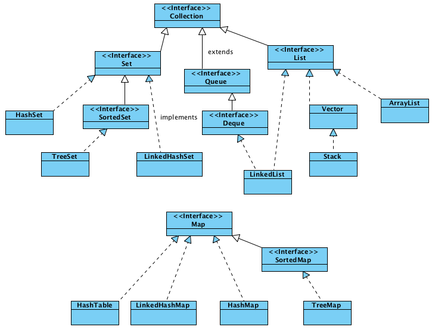

# Lesson 06: Collections Intro, Iterators

## Вступление
Одной из самых частых задач в разработке программ является обработка данных. По этой причине почти никогда данные не обрабатываются по одной единице. Строки из баз данных, список телефонов или адресов, словари и т.п. И нужно было придумать способ для удобного хранения и обработки набора данных как **коллекции** объектов.
И начиная с Java 1.2 появился **[Java Collections Framework](https://docs.oracle.com/javase/8/docs/technotes/guides/collections/overview.html)**.

Был добавлен главный интерфейс - [java.util.collection](https://docs.oracle.com/javase/8/docs/api/java/util/Collection.html). Структура была выбрана следующей:

Как видно, есть ещё одна интересная особенность: **Map** входит в **collection framework**, но не является **Collection**.

Описывает следующие возможные действия, которые возможно выполнить над всеми коллекциями:
- add(Object)
- contains(Object)
- remove(Object)
А так же вариации этих методов со словом **All** на конце, где вместо объекта используется другая коллекция. Например, **addAll(Collection)**.
Так же есть метод **retainAll** - сохранить в коллекции только те элементы, которые входят в другую коллекцию. Данный метод не содержит аналога без All.

Так же мы можем узнать размер коллекции: **size()**
Можем узнать, не пустая ли она: **isEmpty()**
Можем превратить коллекцию в массив: **toArray()**
Можем очистить коллекцию при помощи метода **clear()**
Можем получить итератор по коллекции: **iterator()**

В Java8 так же добавили:
- методы работы со стримами: **stream()** и **parallelStream()**.
- получение сплиттератора: **spliterator()**
- удаление по условию: **removeIf**
- выполнение действия для каждого элемента: **forEach**

## Основные интерфейсы
К основным интерфейсам относятся List, Set и Queue.
**List** - представляет из себя упорядоченный список (так называемый sequence) элементов, в котором есть контроль над расположением элементов, т.к. у каждого элемента есть zero based индекс. Позволяет имеет дублирующие элементы (логично, т.к. у каждого из них будет разный индекс). Может содержать null. Так же List вместе с Iterator'ом позволяет получить особый итератор - **ListIterator**, который позволяет двусторонний обход элементов, а так же позволяет вставлять и замещать. Так же такой итератор можно получить с любого места.
**Set** - это список уникальных элементов, т.е. список не содержащий дубли.
Возможность содержать null зависит от реализаций, но в общем случае допустима.
**Queue** - коллекция, для хранения элементов в виде очереди перед обработкой. Методы имеют дополниельные методы добавления и получения. Каждый из них имеет 2 формы: одна бросает исключения в случае ошибки, а вторая возвращает значение (например, null).

**Map** - данный интерфейс стоит немного в стороне, т.к. он содержит не объекты, а набор "Ключ-значение". Поэтому, далеко не все методы коллекций можно применить к Map. Например, add(Object). Кроме того, если бы с Map работали через Collection, то как в неё добавить другую коллекцию, например List?
Не позволяет иметь одинаковые ключи (что логично, иначе как понять, какой ключ вам нужен). Позволяет получать view содержимого как набор ключей, набор значений или Set ключ-значение.

## Vector (наследие из Java1.0)
Как сказано в [Collections Framework Overview](https://docs.oracle.com/javase/8/docs/technotes/guides/collections/overview.html) Collection включают в себя **"Legacy implementations"**. Т.е. те классы, которые были до Collection Framework. К ним относится, в том числе, класс **Vector**.
Есть одно утверждение, которое нужно помнить: **"Массивы вокруг нас"**.
Если посмотреть, то внутри **Vector** прячется ``Object[] elementData``.
Можно считать, что Vector - обёртка над массивом.
У каждого Vector есть атрибут - **capacitry**, описывающий размер массива.
``По умолчанию размер capacity равен 10``
Так же у Vector есть параметр - **capacityIncrement**. Если он не задан - при достижении максимального размера вектора его размер будет удваиваться. Если capacityIncrement задан - будет увеличиваться на указанное значение.

У вектора есть понятие **Element**: позволяет получать элемент по индексу, добавлять, получать первый элемент, последний элемент.

Vector является реализацией интерфейса **List**

**Недостаток Vector** - его методы синхнонизированы. С одной стороны это значит, что он потокобезопасен. С другой стороны - будет тратить ресурсы на поддержание синхронизации, что делает его медленнее, чем коллекции без синхронизации.

## Iterator
Iterator предоставляется интерфейсом Collection, т.е. есть у всех коллекций.
При помощи итераторов можно выполнять поэлементный обход коллекции.
Iterator предоставляет следующие методы:
- hasNext()
- next()
- remove()
Начиная с Java 8 добавлен так же метод **forEachRemaining**
Основные ограничения: Создаётся с начальной позиции, позволяет перемещаться только в одном направлении.

При модификации коллекции во время итерирования по этой коллекции будет получена ошибка: **java.util.ConcurrentModificationException**. Именно поэтому в него добавили метод **remove**, т.к. удаление из самой коллекции приведёт к ошибке:
```java
List list = new Vector();
list.add("1");
list.add("2");

Iterator iterator = list.iterator();
while (iterator.hasNext()) {
	Object obj = iterator.next();
	//list.remove(obj); Привело бы к ошибке
	iterator.remove();
}
```
При одновременной работе нескольких итераторов над одной коллекцией изменения в одном итераторе приведёт к ошибкам **java.util.ConcurrentModificationException** в других.

## List Iterator
У реализаций List есть свой, особый итератор, свойственный только List.
Называется он **ListIterator**. Главное отличие, на котором строятся все новые функции - он знает про индекс элемента, т.к. index есть только в List. Это позволяет нам добавить элемент в коллекцию (перед next), заменить элемент, который вернулся последним next. Так же можем получать индекс следующего и прошлого элемента.

Так же ListIterator перемещаться и в обратную сторону, используя вместо next и hasNext обратные методы: previous и hasPrevious.

Подробнее можно прочитать здесь:
[Difference between Iterator and ListIterator in java](http://beginnersbook.com/2014/06/difference-between-iterator-and-listiterator-in-java/)

## For-each loop и Iterator
В Java 5 появился так называемый for-each loop, синтаксис которого выглядит следующим образом:
```java
List<String> list = new Vector<>();
list.add("1");
list.add("2");
for (String obj : list) {
	System.out.println(obj);
}
```
На самом деле данный метод вызывает у используемой коллекции метод **iterator()**.
Поочерёдно вызывая методы **hasNext()** и **next()** при помощи итератора обходится вся коллекция. Соответственно, на такой цикл накладываются все те же ограничения, что и на итератор, т.к. это одно и то же.

Хотелось бы отметить, что for-each loop так же реализован и для массивов.
```
The compiler knows if you are using the for-each loop statement for a collection or for an array.
If used for collection, the compiler translates the for-each loop to the equivalent for loop using an Iterator.
If used for an array, the compiler translates the for-each loop to the equivalent for loop using an index variable.
```

## forEach и Java 8
В Java 8 к коллекциям добавлен метод: forEach.
Итераторы разделяются на два вида: внутренние (internal) и внешние (external).
Используя External итераторы мы управляем обходом сами. То есть говорим что надо делать при итерировании и как выполнять итерирование.
Используя Internal мы говорим только то, что нужно делать при итерации.
Добавленный метод forEach является именно тем самым Internal итератором.
Пример:
```java
List<String> list = new Vector<>();
list.add("1");
list.add("2");
list.forEach(new Consumer<String>() {
	@Override
	public void accept(String s) {
		System.out.println(s);
	}
});
```
Подробнее см. в статье: "[Guide to the Java 8 forEach](http://www.baeldung.com/foreach-java)"

## removeIf
Так же в Java 8 есть интересный метод, представляющий возможность выполнить удаление элемента, указав условие. Пример:
```java
List<String> list = new Vector<>();
list.add("1");
list.add("22");
list.removeIf(s -> s.length()>0);
System.out.println( list.size() );
```
Выведет 0, т.к. все строки, содержащие символы, будут удалены.

Внутри removeIf сидит всё тот же итератор:
```java
default boolean removeIf(Predicate<? super E> filter) {
	Objects.requireNonNull(filter);
	boolean removed = false;
	final Iterator<E> each = iterator();
	while (each.hasNext()) {
		if (filter.test(each.next())) {
			each.remove();
			removed = true;
		}
	}
	return removed;
}
```
