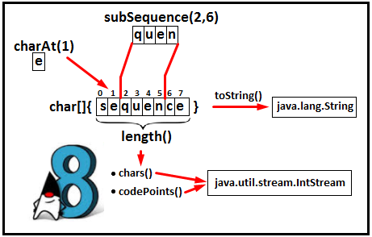
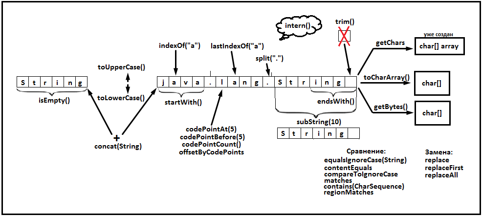

# Lesson 07: String
## Вступление
В Java одним из самых часто используемых типов данных является строки. Строки в языке Java представлены классом **[java.lang.String](https://docs.oracle.com/javase/8/docs/api/java/lang/String.html)**.


Прежде всего, String это **[java.lang.CharSequence](https://docs.oracle.com/javase/8/docs/api/java/lang/CharSequence.html)**, т.е. последовательность char'ов. И действительно, если мы откроем класс String, то увидим, что данные хранятся в ``private final char value[];``
Это даёт нам самое важное свойство: **String не изменяются**.

## CharSequence
Так как это последовательность чаров, то мы можем у **String** узнать эту длинну при помощи метода **length()**. 
Можем узнать, какой char находится на указанной нами позиции при помощи метода **charAt(index)**.
Так же получить часть последовательности при помощи метода **subsequence(int begin, int end)**, где begin включает в себя указанный индекс, а end - нет. Так же мы можем получить из char'ов строку методом **toString**.

Важно вспомнить, что же такое char в Java. Чтобы освежить память, прочитаем про [Primitive Data Types](https://docs.oracle.com/javase/tutorial/java/nutsandbolts/datatypes.html). Там сказано, что char - это ``single 16-bit Unicode character``, т.е. по сути это просто число, максимальный размер которого половина int. Может иметь значение от 0 до 65535.
Это даёт нам то, что любой **char** можно представить в виде **int**.
Например, в **Java 8** это даёт возможность использовать **Stream Api** применительно к char'ам. Для этого в CharSequence добавлен метод **chars()**, возвращающий **IntStream** - стрим для работы с примитивными int'ами. Вот простейший пример:
```java
System.out.println( "aabbccdd".chars().distinct().count() );
```
Такой способ получит стрим для работы с int представлением чаров, получит только уникальные значения, после чего выведет их количество.

Так же есть такое понятие, как **codePoint**. Появилось оно потому, что когда Java появилось, то хватало 16 бит (половина int) чтобы закодировть сивол. Поэтому char в java представлен в UTF-16 формате ("Unicode 88" specification). Позже повяился Unicode 2.0, концепция которого заключалась в представлении символа в виде сурогатной пары (2 чаров). Это позволило расширить диапазон возможных значений до значения int.
Подробнее: ["Comparing a char to a code-point?"](https://stackoverflow.com/questions/1029897/comparing-a-char-to-a-code-point).
На стандартных алфавитах довольно трудно (а может даже нельзя) воспроизвести это. Но символы буквами и цифрами не заканчиваются.
В японии придумали такую сложную для кодировок штуку, как **emoji** - язык идеограмм и смайликов. Есть про это интересная [статья на википедии](https://ru.wikipedia.org/wiki/%D0%AD%D0%BC%D0%BE%D0%B4%D0%B7%D0%B8).
Найдём пример emoji, например такой: ["Emoji Ghost"](https://emojipedia.org/ghost/)
Как мы видим, там даже указан тот самый **codePoint** (значение = U+1F47B).
Указан он в шестнадцатеричном формате. Если перевести в десятичное число, то получим 128123. Это больше, чем позволяет 16 бит (т.е. больше чем 65535). Поэтому, теперь нам будет понятен простой тест:
```java
@Test
public void emojiHasDifferentValues() {
	String emojiString = "👻";
	//На один emojiString приходится 2 чара (т.к. не влезает в 16 бит)
	assertEquals(1, emojiString.codePoints().count());
	assertEquals(2, emojiString.chars().count());
}
```
Итого по CharSequence:


## String Pool
Неизменяемость строк позволило к классу String применить оптимизацию в виде String Pool.
Полезное обсуждение на stackoverflow: ["Where does Java's String constant pool live, the heap or the stack?"](https://stackoverflow.com/questions/4918399/where-does-javas-string-constant-pool-live-the-heap-or-the-stack).
String Pool расположен в **runtime constant pool**, который начиная с Java 7 находится в основной части Heap (там где Old и New Generations).
Runtime constant pool выделяется при создании класса или интерфейса виртуальной машиной из [method area](http://docs.oracle.com/javase/specs/jvms/se8/html/jvms-2.html#jvms-2.5.4) - особой области в Heap, доступ к которой есть у всех потоков внутри виртуальной машины Java.

Что же даёт нам String pool? У этого есть несколько преимуществ:
- Не будут создаваться однотипные объекты
- Сравнение по ссылке быстрее, чем посимвольное сравнение через equals

Но за плюсами всегда стоят минусы. Если String создавался через конструктор класса String, то будет создан новый объект, который не будет помещён в String pool, без явного на то указания. Вот пример:
```java
@Test
	public void shouldCompareStringWithinStringPool() {
		String literalString = "test";
		String anotherLiteralString = "test";
		// Литеральные строки равны, т.к. это один и тот же объект в Heap
        // Т.е. один и тот же Reference из пула
		assertTrue(literalString == anotherLiteralString);
		// Это новый String объект, его в пуле нет
		String constructedString = new String("test");
		// Добавляем строку в пул, получаем reference на тот String, который в пуле
		String pooled = constructedString.intern();

		assertTrue(literalString != constructedString);
		assertTrue(literalString == pooled);
		// intern() возвращает новый reference на объект из пула
        // старый reference по прежнему не в пуле!
		assertTrue(pooled != constructedString);
	}
```
## Comparable
String является comparable
Это значит, что он реализует метод **compareTo(Другой объект)**.
Выполняется это при помощи посимвольного сравнения.
Интересно, что из двух строк выбирается минимальная длинна и по ней выполняется цикл.
Поэтому, **compareTo** вернёт или разницу между int значениями первых несовпавших символов в пределе наименьшей из длинн строк, либо вернёт разницу между длиннами строк, если в пределах минимальной длинны строки все символы совпадают.

```java
@Test
public void shouldCompareStringAsCharIntValues(){
	String firstString = "Java Core";
	String secondString = "Java Core Epam";
	String thirdString = "Java core Epam";
	assertEquals(-5, firstString.compareTo(secondString));
	assertEquals(-32, secondString.compareTo(thirdString));
}
```

## Методы String
Существует множество методов для работы со String. Они описаны в JavaDoc к методам, поэтому можно лишь постараться запомнить общие правила:
- Любой String неизменяем. Если над ним выполняются действия - вернётся новый объект
- Т.к. String основан на массиве, то индексы символов Zero-based, т.е. начинаются с 0
- Диапазон включает начальный индекс, но исключает последний.
Например: Для "JavaCore" core будет иметь диапазон 4 - 8 (т.е. String.length()).

Примерный список методов на картинке ниже:
